# Video Frame Predictor Architecture

This document describes the detailed architecture of the current transformer-based video frame prediction model with residual learning and composite loss functions.

## Architecture Overview

```mermaid
graph TB
    subgraph Input["Input Stage"]
        A["Input Frames<br/>[B, 10, 3, 24, 32]"]
        A1["Last Input Frame<br/>[B, 3, 24, 32]<br/>(stored for residual)"]
        A --> A1
    end

    subgraph Encoder["Frame Encoder (CNN)"]
        B1["Conv2d(3→32, k=7, s=2)<br/>Output: [B×10, 32, 12, 16]"]
        B2["ReLU"]
        B3["Conv2d(32→64, k=3, s=2)<br/>Output: [B×10, 64, 6, 8]"]
        B4["ReLU"]
        B5["Conv2d(64→128, k=3, s=2)<br/>Output: [B×10, 128, 3, 4]"]
        B6["ReLU"]
        B7["AdaptiveAvgPool2d(1,1)<br/>Output: [B×10, 128, 1, 1]"]
        B8["Flatten<br/>Output: [B×10, 128]"]
        B9["Linear(128→256)<br/>Output: [B×10, 256]"]
        
        A --> B1 --> B2 --> B3 --> B4 --> B5 --> B6 --> B7 --> B8 --> B9
    end

    subgraph Reshape1["Reshape to Sequence"]
        C["Reshape<br/>[B×10, 256] → [B, 10, 256]"]
        B9 --> C
    end

    subgraph Transformer["Transformer Encoder"]
        D1["TransformerEncoderLayer 1<br/>d_model=256, nhead=8<br/>dim_feedforward=1024"]
        D2["TransformerEncoderLayer 2<br/>d_model=256, nhead=8<br/>dim_feedforward=1024"]
        D3["TransformerEncoderLayer 3<br/>d_model=256, nhead=8<br/>dim_feedforward=1024"]
        D4["TransformerEncoderLayer 4<br/>d_model=256, nhead=8<br/>dim_feedforward=1024"]
        D5["Temporal Features<br/>[B, 10, 256]"]
        
        C --> D1 --> D2 --> D3 --> D4 --> D5
    end

    subgraph Extract["Extract Last Feature"]
        E["Last Temporal Feature<br/>[B, 256]<br/>(contains context from all 10 frames)"]
        D5 --> E
    end

    subgraph ResidualPredictor["Residual Predictor"]
        F1["Linear(256→256)"]
        F2["ReLU"]
        F3["Linear(256→2560)<br/>(256 × 10 output frames)"]
        F4["Reshape<br/>[B, 2560] → [B×10, 256]"]
        
        E --> F1 --> F2 --> F3 --> F4
    end

    subgraph Decoder["Frame Decoder (Transposed CNN)"]
        G1["Linear(256→128)<br/>Output: [B×10, 128]"]
        G2["Reshape to [B×10, 128, 1, 1]"]
        G3["ConvTranspose2d(128→128, k=(3,4))<br/>Output: [B×10, 128, 3, 4]"]
        G4["ReLU"]
        G5["ConvTranspose2d(128→64, k=3, s=2)<br/>Output: [B×10, 64, 6, 8]"]
        G6["ReLU"]
        G7["ConvTranspose2d(64→32, k=3, s=2)<br/>Output: [B×10, 32, 12, 16]"]
        G8["ReLU"]
        G9["ConvTranspose2d(32→3, k=7, s=2)<br/>Output: [B×10, 3, 24, 32]"]
        G10["Tanh<br/>(output in [-1, 1])"]
        G11["Residual Frames<br/>[B×10, 3, 24, 32]"]
        
        F4 --> G1 --> G2 --> G3 --> G4 --> G5 --> G6 --> G7 --> G8 --> G9 --> G10 --> G11
    end

    subgraph Reshape2["Reshape Residual"]
        H["Reshape<br/>[B×10, 3, 24, 32] → [B, 10, 3, 24, 32]"]
        G11 --> H
    end

    subgraph ResidualAdd["Residual Addition"]
        I1["Base Frame<br/>[B, 1, 3, 24, 32]<br/>(last input frame)"]
        I2["Residual<br/>[B, 10, 3, 24, 32]"]
        I3["Add (broadcast)<br/>base + residual"]
        I4["Clamp(0, 1)"]
        
        A1 --> I1
        H --> I2
        I1 --> I3
        I2 --> I3
        I3 --> I4
    end

    subgraph Output["Output Stage"]
        J["Predicted Frames<br/>[B, 10, 3, 24, 32]"]
        I4 --> J
    end

    style Input fill:#e1f5ff
    style Encoder fill:#fff4e1
    style Transformer fill:#f0e1ff
    style ResidualPredictor fill:#ffe1e1
    style Decoder fill:#fff4e1
    style ResidualAdd fill:#e1ffe1
    style Output fill:#e1f5ff
```



## Detailed Layer Specifications

### Frame Encoder (CNN)
- **Input**: RGB frames [batch × num_frames, 3, 24, 32]
- **Architecture**:
  - Conv2d: 3 → 32 channels, kernel=7, stride=2, padding=3
  - Conv2d: 32 → 64 channels, kernel=3, stride=2, padding=1
  - Conv2d: 64 → 128 channels, kernel=3, stride=2, padding=1
  - AdaptiveAvgPool2d: (1, 1) - Global average pooling
  - Linear: 128 → 256 (feature dimension)
- **Output**: Feature vectors [batch × num_frames, 256]

### Transformer Encoder
- **Layers**: 4 TransformerEncoderLayers
- **Configuration**:
  - d_model: 256
  - nhead: 8 (multi-head attention)
  - dim_feedforward: 1024
  - dropout: 0.1
  - batch_first: True
- **Purpose**: Learn temporal dependencies across input frames

### Residual Predictor
- **Input**: Last temporal feature [batch, 256]
- **Architecture**:
  - Linear: 256 → 256
  - ReLU
  - Linear: 256 → 2560 (256 × 10 output frames)
- **Initialization**: Last layer initialized to zeros (outputs zero residuals initially)
- **Output**: Residual features [batch × output_frames, 256]

### Frame Decoder (Transposed CNN)
- **Input**: Residual features [batch × output_frames, 256]
- **Architecture**:
  - Linear: 256 → 128
  - ConvTranspose2d: 128 → 128, kernel=(3, 4)
  - ConvTranspose2d: 128 → 64, kernel=3, stride=2
  - ConvTranspose2d: 64 → 32, kernel=3, stride=2
  - ConvTranspose2d: 32 → 3, kernel=7, stride=2
  - Tanh (output range: [-1, 1])
- **Initialization**: Last conv layer initialized to zeros
- **Output**: Residual frames [batch × output_frames, 3, 24, 32]

### Residual Addition
- **Operation**: `output = clamp(last_input_frame + residual, 0, 1)`
- **Purpose**: Predict changes rather than absolute frames
- **Benefit**: Easier to learn small changes between consecutive frames

## Loss Function Strategy

To combat the "static prediction" issue common in MSE-based video prediction, we employ a composite loss function (`CombinedLoss`):

$$ L_{total} = \lambda_{mse}L_{mse} + \lambda_{temp}L_{temporal} + \lambda_{grad}L_{grad} + \lambda_{percept}L_{perceptual} $$

### 1. MSE Loss ($L_{mse}$)
- Standard Mean Squared Error between predicted and target pixels.
- Ensures global consistency but can lead to blurry averages.

### 2. Temporal Difference Loss ($L_{temporal}$)
- Computes MSE between the *differences* of consecutive frames: 
  $$ L_{temp} = MSE((P_t - P_{t-1}), (T_t - T_{t-1})) $$
- **Benefit**: Explicitly forces the model to predict the *motion* correctly. If the model predicts a static frame ($P_t = P_{t-1}$), this loss will be high if the ground truth has motion.

### 3. Gradient Loss ($L_{grad}$)
- Computes MSE between the spatial gradients (Sobel filters) of prediction and target.
- **Benefit**: Penalizes blurry edges. Forces the model to generate sharp structures.

### 4. Perceptual Loss ($L_{perceptual}$)
- Computes MSE between feature maps extracted from a pretrained VGG16 network.
- **Benefit**: Ensures high-level semantic similarity (e.g., maintaining object shapes) rather than just pixel-perfect matches.

## Configuration (config.yaml)

```yaml
model:
  input_frames: 10      # Number of input frames
  output_frames: 10     # Number of frames to predict
  feature_dim: 256      # Feature vector dimension
  nhead: 8              # Attention heads
  num_layers: 4         # Transformer layers
  dim_feedforward: 1024 # FFN dimension
  dropout: 0.1

loss:
  mse_weight: 1.0
  temporal_weight: 1.0  # Emphasize temporal consistency
  gradient_weight: 1.0  # Emphasize structural sharpness
  perceptual_weight: 0.1 # High-level feature matching
```
